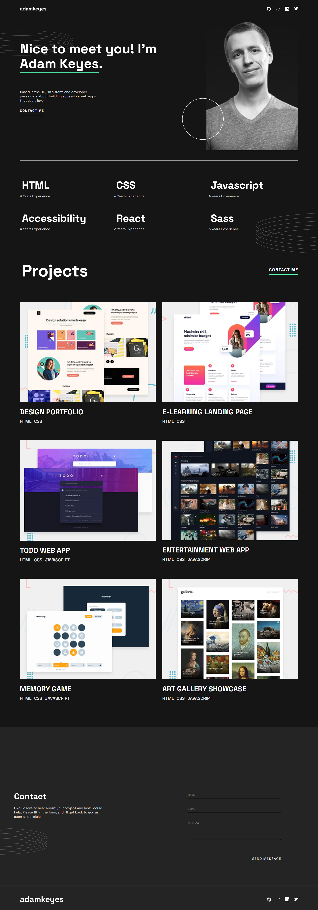

# Responsive Portfolio Website

A fully responsive personal portfolio website built with **HTML**, **SCSS**, and **Vite**, based on a Figma design.  
The project focuses on clean layout structure, modern CSS practices, and a mobile-first responsive approach.

👉 **Live Demo:**  
[https://mariafernandamamone.github.io/CSS-Responsive-Portfolio/](https://mariafernandamamone.github.io/CSS-Responsive-Portfolio/)

---

## 🔗 Preview

[](https://mariafernandamamone.github.io/CSS-Responsive-Portfolio/)

_Click the image to open the live site._

---

## 📖 About This Project

This project is a responsive portfolio website created as part of a front-end development challenge.  
The main goal was to translate a Figma design into clean, semantic HTML and scalable SCSS, ensuring pixel consistency and a smooth responsive experience across devices.

Special attention was given to layout structure, hover interactions on desktop, and maintaining visual balance between mobile, tablet, and desktop views.

The project was built using Vite for fast development and optimized production builds, and deployed using GitHub Pages.

---

## ✨ Features

- Fully responsive layout (mobile, tablet, desktop)
- CSS Grid and Flexbox for layout structure
- Hover effects and desktop interactions
- SCSS architecture with variables and mixins
- Clean, semantic HTML
- Optimized build with Vite
- Deployed on GitHub Pages

---

## 🛠️ Built With

- **HTML5**
- **SCSS (Sass)**
- **Vite**
- **GitHub Pages**
- **Figma** (design reference)

---

## 📱 Responsive Design

The layout adapts to different screen sizes:

- **Mobile:** stacked layout optimized for small screens
- **Tablet:** flexible layout with improved spacing
- **Desktop:** grid-based layout with hover overlays and enhanced interactions

---

## 🚀 Getting Started

To run this project locally, follow these steps:

### 1️⃣ Clone the repository

```bash
git clone https://github.com/mariafernandamamone/CSS-Responsive-Portfolio.git
```

### 2️⃣ Navigate to the project folder

```bash
cd CSS-Responsive-Portfolio
```

### 3️⃣ Install dependencies

```bash
npm install
```

### 4️⃣ Run the development server

```bash
npm run dev
```

### The project will be available at: http://localhost:5173

---

### 👩‍💻 Author

María Fernanda Mamone

LinkedIn:
https://www.linkedin.com/in/maría-fernanda-a385ab317
